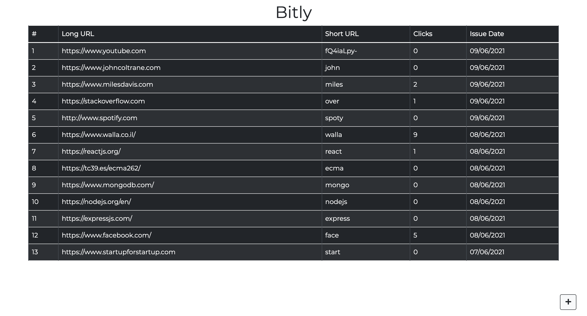
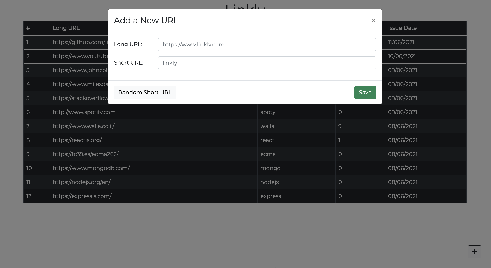
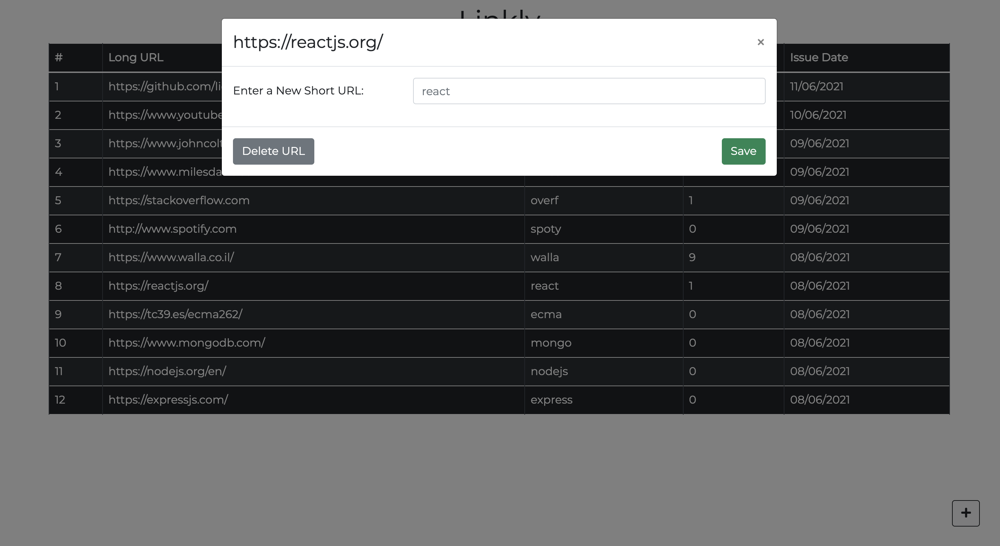
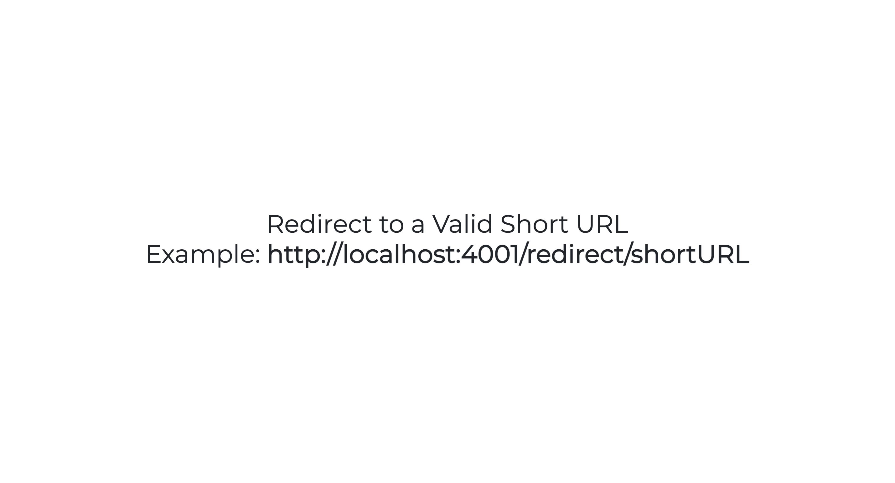

# Linkly
**Because every decent app's name ends with a "ly" ;)**

A small bitly-clone app

Demo: [Linkly](https://linklly.herokuapp.com/)

## Table Of Contents
- [Linkly](#bitly)
  - [Table Of Contents](#table-of-contents)
  - [Features](#Features)
  - [Running the project](#running-the-project)
  - [Screenshots](#screenshots)
  - [Tech Stack](#tech-stack)

## Features
### Admin: (default route `/admin`)
1. Click on the `+` button (bottom right-hand corner) to add a URL with a shortcut - note that the short URL need to be unique, and that there is a `Random Short URL` button to create one for you. Also be aware that the given URLs have to start with 'http' / 'https' / 'ftp' prefix protocol
2. See a list of saved URLs with their short URLs, Date of issue and a `Clicks` column for the number of time that the specific URL was visited.
3. Click on a URL from the list to edit and change the short URL or to delete that URL completely
### Redirect: (`/redirect/<ShortURL>`)
1. Navigate to `http://localhost:4001/redirect/<ShortURL>`. Replace the `<ShortURL>` with a short URL that you've created as an admin - this will redirect you to the original URL and keep track of the number of times you used that short URL

## Running the project

1. Clone the repository and navigate to root directory
2. Run `npm install`
3. Run `cp .env.sample .env` to create an `.env` file
4. In the `.env` file you will need to set the `DB_URL` with a mongoDB connection string
5. Run `npm run server` (assuming you have `nodemon`, if not - run `npm start`)
4. Run `npm run dev`
5. Navigate to `http://localhost:4001`. This will get you automatically to the `admin` page

## Screenshots
### Admin: Main Page

  

### Admin: Adding new URL

  

### Admin: Update URL

 

### Redirect: Default page (if the short URL is invalid)

 

## Tech-stack
1. React
2. Express
3. MongoDB
4. React-Bootstrap
