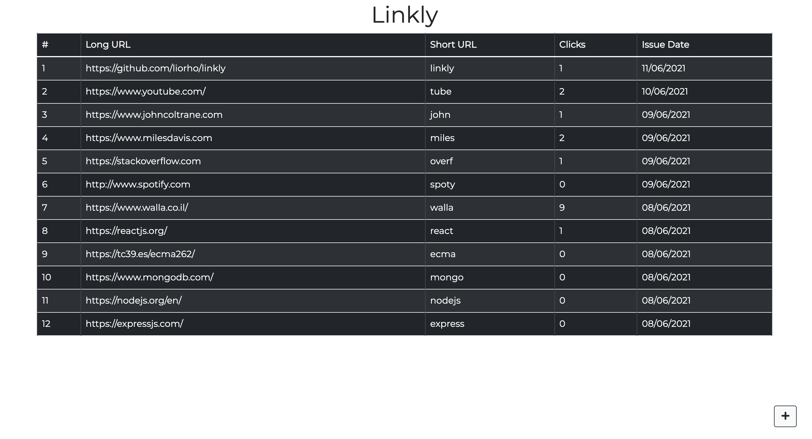

# Bitly
**Because every decent app's name ends with a "ly" ;)**

A small bitly-clone app

*******************
TODO:
Upload to heroku - see how it work with redirect

set ref to post Modal

change readme link to heroku

********************

Demo: [Bitly](http://liorho.github.io/Lior-Hoshea-20-05-2020)

## Table Of Contents
- [Bitly](#bitly)
  - [Table Of Contents](#table-of-contents)
  - [Features](#Features)
  - [Running the project](#running-the-project)
  - [Screenshots](#screenshots)
  - [Tech Stack](#tech-stack)

## Features
1. Search for a city and get its current weather and a five day forecast
2. Autocomplete cities search
3. Show the weather in your current location by default
4. Mark cities as favorites
5. Choose a preferred theme (Dark/Light mode)
6. Choose a preferred temperature unit (Celsius/Fahrenheit)
7. Fully responsive
8. Weather is Provided by [AccuWeather](https://developer.accuweather.com/).

Note that the URLs given have to be real ones which start with 'http' or 'https'

## Running the project

1. Clone the repository and navigate to root directory
2. Run `npm install`
3. Run `cp .env.sample .env` to create a `.env` file
4. In the `.env` file you will need to set the `DB_URL` with a mongoDB connection string.
5. Run `npm run server` (assuming you have `nodemon`, if not - run `npm start`)
4. Run `npm run dev`
5. Navigate to `http://localhost:4001`. This will get you automatically to the `admin` page.

## Screenshots
### Admin: Main Page

  

### Admin: Adding new URL

  

### Admin: Update URL

 

### Redirect: Default page (when the short URL is invalid)

 

## Tech-stack
1. React
2. express
3. mongoDB
4. React-Bootstrap
